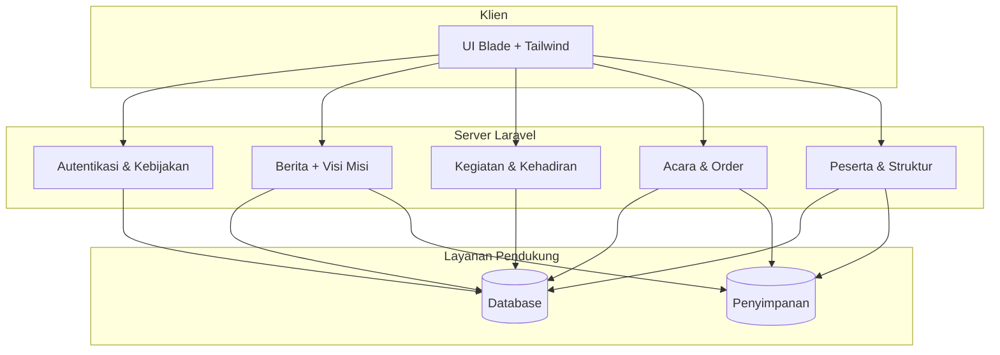
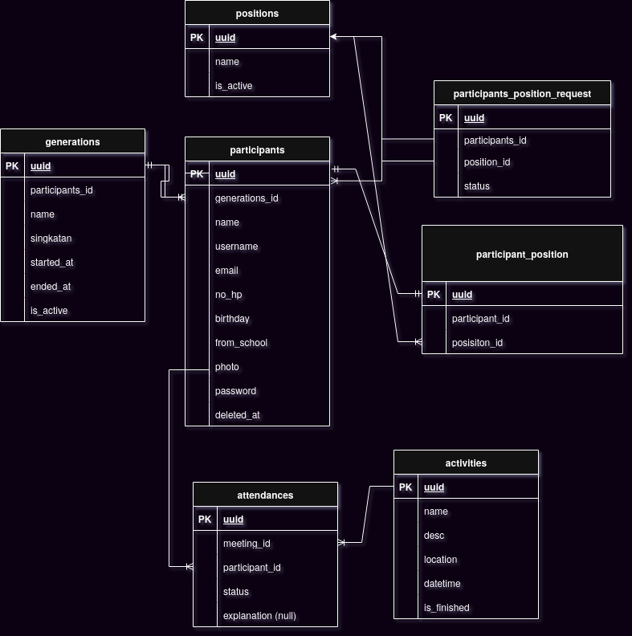
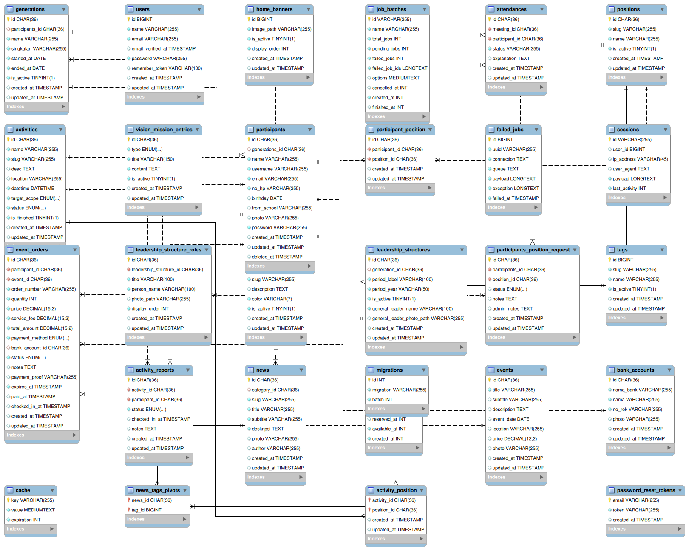
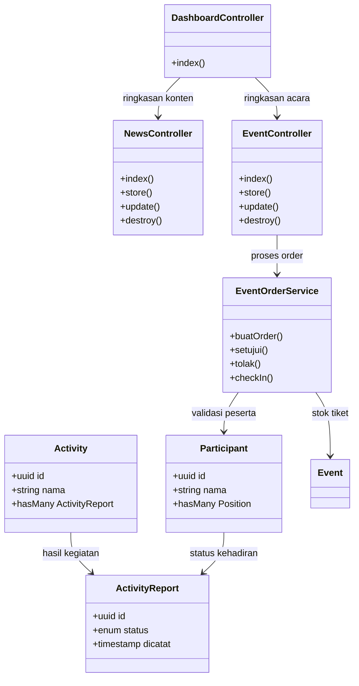

# FosjaBar System

Panel admin internal untuk Forum OSIS Jawa Barat. Sistem ini mengatur konten situs, kegiatan internal, peserta, struktur kepemimpinan, sampai pemesanan tiket acara.

## Fitur Utama
- **Dasbor**: Ringkasan jumlah peserta, acara, dan order yang harus ditindak.
- **Berita & Konten**: CRUD berita beserta kategori, tag, status aktif, dan unggahan foto.
- **Acara & Order**: Kelola acara gratis/berbayar, akun bank, order tiket, bukti bayar, check-in, dan catatan.
- **Partisipan & Organisasi**: Data generasi, posisi, permintaan jabatan, struktur kepemimpinan dinamis, dan banner beranda.
- **Aktivitas Internal**: Jadwal rapat/kegiatan, laporan kehadiran, serta pembatasan posisi yang boleh ikut.
- **Visi & Misi**: Daftar visi/misi aktif yang ditampilkan ke publik.

## Teknologi
- Laravel 12 (PHP 8.2) + Breeze untuk autentikasi.
- Blade, TailwindCSS, Vite, dan Alpine.js untuk antarmuka.
- Database relasional (MySQL/PostgreSQL) dengan UUID pada tabel domain.

## Persiapan Lingkungan
1. **Syarat**: PHP 8.2+, Composer 2, Node.js 18+, npm 9+, dan server database.
2. **Instalasi dasar**
   ```bash
   cp .env.example .env
   composer install
   php artisan key:generate
   npm install
   ```
3. **Atur `.env`** untuk koneksi database, pengiriman email, dan penyimpanan berkas.
4. **Migrasi**
   ```bash
   php artisan migrate
   ```

## Menjalankan Aplikasi
```bash
composer run dev      # jalankan mode pengembangan lengkap

# atau jalankan manual
php artisan serve
npm run dev
```

Build produksi:
```bash
npm run build
php artisan config:cache route:cache view:cache
```

## Arsitektur Singkat


## ERD Singkat





## UML Use Case - Sistem Pendaftaran Anggota

📄 **[Lihat Use Case Diagram Lengkap](docs/USE_CASE_DIAGRAM.md)**

```mermaid
graph LR
    ADMIN[<center><br/>ADMIN/<br/>PENGURUS</center>]
    GUEST[<center><br/>GUEST</center>]
    ANGGOTA[<center><br/>ANGGOTA</center>]

    subgraph "Sistem Pendaftaran Anggota FOSJABAR"
        UC1(Buat Position Guest)
        UC2(Buat Generasi)
        UC3(Buka Pendaftaran)
        UC4(Register)
        UC5(Login)
        UC6(Dashboard Tamu)
        UC7(Ajukan Jadi Anggota)
        UC8(Buat Participant<br/>Position Request)
        UC9(Lihat Pengajuan)
        UC10(Review & Approve)
        UC11(Update Status)
        UC12(Ajukan Jadi Pengurus)
        UC13(Buat Request Pengurus)
        UC14(Approve Pengurus)
    end

    ADMIN --- UC1
    ADMIN --- UC2
    ADMIN --- UC9
    ADMIN --- UC14
    GUEST --- UC4
    GUEST --- UC6
    GUEST --- UC7
    ANGGOTA --- UC12

    UC2 -.->>|<<include>>| UC3
    UC4 -.->>|<<include>>| UC5
    UC7 -.->>|<<include>>| UC8
    UC9 -.->>|<<include>>| UC10
    UC10 -.->>|<<include>>| UC11
    UC12 -.->>|<<include>>| UC13

    classDef actor fill:#ffffff,stroke:none;
    class ADMIN,GUEST,ANGGOTA actor;
    classDef usecase fill:#ffffff,stroke:#333,stroke-width:1px;
    linkStyle 0,1,2,3,4,5,6,7 stroke-width:2px,fill:none,stroke:#333;
    linkStyle 8,9,10,11,12,13 stroke-width:1px,fill:none,stroke:#333,stroke-dasharray: 5 5;
```

### Alur Singkat:
1. **Admin** membuat Position Guest & Generasi → Buka Pendaftaran
2. **Guest** Register → Login → Dashboard Tamu → Ajukan Jadi Anggota
3. **Admin** Review & Approve → Guest jadi Anggota
4. **Anggota** bisa ajukan jadi Pengurus → Admin Approve

---

## UML Class Diagram


> **Catatan**: Semua tabel domain inti menggunakan UUID sehingga perhatikan dukungan DB ketika melakukan dump/import.

## Testing
```bash
php artisan test
```
Gunakan database pengujian terpisah (lihat `phpunit.xml`) supaya data produksi aman.

## Lisensi
Kode ini mengikuti lisensi MIT bawaan Laravel kecuali ada ketentuan lain pada repositori ini.
