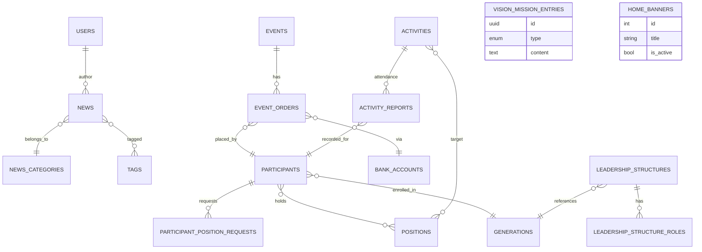

# FosjaBar System

Panel administrasi internal untuk Forum OSIS Jawa Barat. Aplikasi ini berfungsi sebagai pusat kendali konten (berita, kegiatan, event publik), manajemen partisipan, struktur kepemimpinan, serta penjualan tiket event dengan alur pembayaran terkontrol.

## Fitur Utama
- **Dashboard**: Statistik cepat peserta, event, dan transaksi untuk admin terverifikasi.
- **Berita & Konten**: CRUD berita lengkap dengan kategori, tag, status aktif, dan unggahan foto.
- **Event & Pemesanan**: Kelola event berbayar/gratis, akun bank, dan order tiket beserta validasi pembayaran, check-in, dan catatan layanan.
- **Partisipan & Organisasi**: Data generasi, posisi, permintaan jabatan, struktur kepemimpinan dinamis, dan banner beranda.
- **Aktivitas Internal**: Agenda rapat/kegiatan dengan cakupan posisi tertentu, laporan kehadiran, serta keterkaitan posisi yang terlibat.
- **Visi & Misi**: Modul sederhana untuk menampilkan daftar visi/ misi organisasi dengan status aktif.

## Teknologi
- Laravel 12 (PHP 8.2) + Breeze untuk autentikasi.
- Blade + TailwindCSS + Vite + Alpine.js untuk UI reaktif.
- MySQL/PostgreSQL kompatibel melalui Eloquent ORM dengan UUID sebagai kunci utama domain inti.

## Persiapan Lingkungan
1. **Kebutuhan**: PHP 8.2+, Composer 2.x, Node.js 18+, npm 9+, dan database MySQL/PostgreSQL.
2. **Konfigurasi awal**
   ```bash
   cp .env.example .env
   composer install
   php artisan key:generate
   npm install
   ```
3. **Sesuaikan `.env`** pada bagian database, mail, storage (S3/local), dan konfigurasi queue bila diperlukan.
4. **Migrasi & seed** (opsional seed manual jika sudah tersedia):
   ```bash
   php artisan migrate
   ```

## Menjalankan Aplikasi
```bash
# mode pengembangan
composer run dev

# atau manual
php artisan serve
npm run dev
```

Untuk build produksi:
```bash
npm run build
php artisan config:cache route:cache view:cache
```

## Arsitektur Tingkat Tinggi
```mermaid
graph TD
    subgraph Client
        UI[Blade + Tailwind UI]
    end

    subgraph Server (Laravel)
        Auth[Auth & Policy]
        CMS[News & Vision/Mission]
        Activities[Activities & Attendance]
        Events[Events & Orders]
        Org[Participants & Leadership]
    end

    subgraph External
        Storage[(Storage/S3)]
        DB[(Relational DB)]
    end

    UI -->|HTTP| Auth
    UI --> CMS
    UI --> Activities
    UI --> Events
    UI --> Org
    Auth --> DB
    CMS --> DB
    Activities --> DB
    Events --> DB
    Org --> DB
    CMS --> Storage
    Events --> Storage
    Org --> Storage
```

## ERD Singkat




## UML Singkat


> **Catatan**: Semua tabel domain inti menggunakan UUID sehingga perhatikan dukungan DB ketika melakukan dump/import.

## Testing
```bash
php artisan test
```
Pastikan membuat database khusus pengujian (lihat `phpunit.xml`) agar tidak mencampur data produksi.

## Lisensi
Kode ini mengikuti lisensi MIT bawaan Laravel kecuali dinyatakan berbeda dalam repositori ini.
