# Use Case Diagram - Sistem Pendaftaran Anggota FOSJABAR

## Use Case Diagram

```mermaid
graph LR
    ADMIN["👤 ADMIN/PENGURUS"]
    GUEST["👤 GUEST"]
    ANGGOTA["👤 ANGGOTA"]

    subgraph Sistem["Sistem Pendaftaran Anggota FOSJABAR"]
        UC1(["Buat Position Guest"])
        UC2(["Buat Generasi"])
        UC3(["Buka Pendaftaran"])
        UC4(["Register"])
        UC5(["Login"])
        UC6(["Dashboard Tamu"])
        UC7(["Ajukan Jadi Anggota"])
        UC8(["Buat Participant Position Request"])
        UC9(["Lihat Pengajuan"])
        UC10(["Review & Approve"])
        UC11(["Update Status"])
        UC12(["Ajukan Jadi Pengurus"])
        UC13(["Buat Request Pengurus"])
        UC14(["Approve Pengurus"])
    end

    ADMIN --- UC1
    ADMIN --- UC2
    ADMIN --- UC9
    ADMIN --- UC14
    GUEST --- UC4
    GUEST --- UC6
    GUEST --- UC7
    ANGGOTA --- UC12

    UC2 -.->|include| UC3
    UC4 -.->|include| UC5
    UC7 -.->|include| UC8
    UC9 -.->|include| UC10
    UC10 -.->|include| UC11
    UC12 -.->|include| UC13

    classDef actor fill:#e1f5ff,stroke:#333,stroke-width:2px
    classDef usecase fill:#fff,stroke:#333,stroke-width:1px
    class ADMIN,GUEST,ANGGOTA actor
    class UC1,UC2,UC3,UC4,UC5,UC6,UC7,UC8,UC9,UC10,UC11,UC12,UC13,UC14 usecase
```



---

## Diagram ASCII (Alternatif)

<details>
<summary>Klik untuk lihat versi ASCII</summary>

```
                                 ┌─────────────────────────────────────────────────┐
                                 │                                                 │
                                 │      SISTEM PENDAFTARAN ANGGOTA FOSJABAR        │
                                 │                                                 │
    ┌──────────┐                 │                                                 │                 ┌──────────┐
    │          │                 │                                                 │                 │          │
    │          │                 │      ( Buat Position Guest )                    │                 │          │
    │          │────────────────────────────────o                                  │                 │          │
    │          │                 │                                                 │                 │          │
    │          │                 │      ( Buat Generasi )                          │                 │          │
    │  ADMIN/  │────────────────────────────────o                                  │                 │          │
    │ PENGURUS │                 │                 │                               │                 │          │
    │          │                 │                 │                               │                 │  GUEST   │
    │          │                 │                 │ <<include>>                   │                 │          │
    │          │                 │                 └────────►( Buka Pendaftaran )  │                 │          │
    │          │                 │                                                 │                 │          │
    │          │                 │                                                 │                 │          │
    │          │                 │                           ( Register )──────────────────────────────│          │
    │          │                 │                                 o               │                 │          │
    │          │                 │                                 │               │                 │          │
    │          │                 │                                 │ <<include>>   │                 │          │
    │          │                 │                                 └───►( Login )──────────────────────│          │
    │          │                 │                                         o       │                 │          │
    │          │                 │                                         │       │                 │          │
    │          │                 │                                         │       │                 │          │
    │          │                 │                          ( Dashboard Tamu )─────────────────────────│          │
    │          │                 │                                         │       │                 │          │
    │          │                 │                                         │       │                 │          │
    │          │                 │                                         │       │                 │          │
    │          │                 │                    ( Ajukan Jadi Anggota )──────────────────────────│          │
    │          │                 │                                 o               │                 │          │
    │          │                 │                                 │               │                 │          │
    │          │                 │                                 │ <<create>>    │                 │          │
    │          │                 │              ( Buat Participant Position Request )                 │          │
    │          │                 │                                 │               │                 │          │
    │          │                 │      ( Lihat Pengajuan )        │               │                 │          │
    │          │────────────────────────────────o                  │               │                 │          │
    │          │                 │              │                  │               │                 │          │
    │          │                 │              │<<include>>       │               │                 │          │
    │          │                 │              └─────►( Review & Approve )        │                 │          │
    │          │────────────────────────────────────────o                          │                 │          │
    │          │                 │                      │                          │                 │          │
    │          │                 │                      │ <<update>>               │                 │          │
    │          │                 │                      └────►( Update Status )    │                 │          │
    │          │                 │                                                 │                 │          │
    │          │                 │                                                 │                 └──────────┘
    │          │                 │                                                 │
    │          │                 │                                                 │                 ┌──────────┐
    │          │                 │                                                 │                 │          │
    │          │                 │           ( Ajukan Jadi Pengurus )──────────────────────────────────│ ANGGOTA │
    │          │                 │                                 o               │                 │          │
    │          │                 │                                 │               │                 │          │
    │          │                 │                                 │ <<create>>    │                 │          │
    │          │                 │      ( Buat Request Pengurus )  │               │                 │          │
    │          │────────────────────────────────o                  │               │                 │          │
    │          │                 │              │                  │               │                 │          │
    │          │                 │              │<<include>>       │               │                 │          │
    │          │                 │              └────►( Approve Pengurus )         │                 │          │
    │          │────────────────────────────────────────o                          │                 │          │
    │          │                 │                                                 │                 │          │
    └──────────┘                 │                                                 │                 └──────────┘
                                 │                                                 │
                                 └─────────────────────────────────────────────────┘
```

</details>

---

## Penjelasan Role

### Role (Peran):
1. **Admin/Pengurus** (kiri) - Mengelola sistem, membuka pendaftaran, menyetujui pengajuan
2. **Guest** (kanan atas) - User baru yang mendaftar, belum menjadi anggota
3. **Anggota** (kanan bawah) - User yang sudah disetujui menjadi anggota resmi

---

## Deskripsi Use Case

### Use Case Admin/Pengurus:
1. **Buat Position Guest** - Admin membuat posisi untuk guest (persiapan awal)
2. **Buat Generasi** - Admin membuat generasi baru yang akan dibuka
3. **Buka Pendaftaran** - Otomatis include setelah membuat generasi
4. **Lihat Pengajuan** - Admin melihat semua pengajuan yang masuk
5. **Review & Approve** - Admin mereview dan menyetujui/menolak pengajuan
6. **Approve Pengurus** - Admin menyetujui pengajuan menjadi pengurus

### Use Case Guest:
1. **Register** - User mendaftar akun baru (otomatis status: guest)
2. **Login** - Login masuk ke sistem (include setelah register)
3. **Dashboard Tamu** - Halaman dashboard untuk guest
4. **Ajukan Jadi Anggota** - Guest mengajukan diri untuk menjadi anggota

### Use Case Anggota:
1. **Ajukan Jadi Pengurus** - Anggota mengajukan diri untuk menjadi pengurus

### Use Case Sistem:
1. **Buat Participant Position Request** - Sistem membuat data pengajuan
2. **Update Status** - Sistem update status user setelah di-approve

---

## Alur Proses Sederhana

### Fase 1: Persiapan (Admin)
```
Admin → Buat Position Guest → Buat Generasi → Pendaftaran Terbuka
```

### Fase 2: Pendaftaran (Guest)
```
Guest → Register → Login → Dashboard Tamu → Ajukan Jadi Anggota
                                                      ↓
                                            [Menunggu Approval]
```

### Fase 3: Approval (Admin)
```
Admin → Lihat Pengajuan → Review & Approve → Status: Anggota
```

### Fase 4: Pengurus (Opsional)
```
Anggota → Ajukan Jadi Pengurus → Admin Approve → Status: Pengurus
```

---

## Alur Sederhana:

```
ADMIN                           GUEST/USER                      SISTEM
  |                                 |                              |
  |--[1] Buat Position Guest------->|                              |
  |                                 |                              |
  |--[2] Buat Generation----------->|                              |
  |                                 |                              |
  |                                 |--[3] Registrasi------------->|
  |                                 |                              |
  |                                 |<--Set Status: Guest----------|
  |                                 |                              |
  |                                 |--[4] Login------------------>|
  |                                 |                              |
  |                                 |<--Dashboard Tamu-------------|
  |                                 |                              |
  |                                 |--[5] Ajukan Anggota--------->|
  |                                 |                              |
  |<--[6] Notif Pengajuan Baru------|                              |
  |                                 |                              |
  |--[7] Review & Approve---------->|                              |
  |                                 |                              |
  |                                 |<--Status: Anggota------------|
  |                                 |                              |
  |                                 |--[8] Ajukan Pengurus-------->|
  |                                 |                              |
  |<--[9] Notif Pengajuan-----------|                              |
  |                                 |                              |
  |--[10] Approve Pengurus--------->|                              |
  |                                 |                              |
  |                                 |<--Status: Pengurus-----------|
```

---

## Status Flow:

```
[Guest] ──(ajukan)──> [Pending Anggota] ──(admin approve)──> [Anggota]
                                                                  │
                                                                  │
                                                           (ajukan pengurus)
                                                                  │
                                                                  ▼
                                              [Pending Pengurus] ──(admin approve)──> [Pengurus]
```